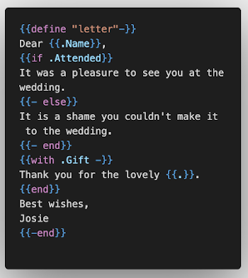

# vscode-gotexttemplate

VSCode Syntax highlighting for Go text/template files

> **nb** Doesn't support highlighting embedded in HTML files (for `html/template`) although
may be a future enhancement - or may be used as a base for such an extension!

## Features

Syntax highlighting for `text/template` in `.tmpl` files

> Example (taken from [text/template](https://golang.org/src/text/template/example_test.go) tests)

## Known Issues

None

## Release Notes

### 0.0.1

Initial testing release
